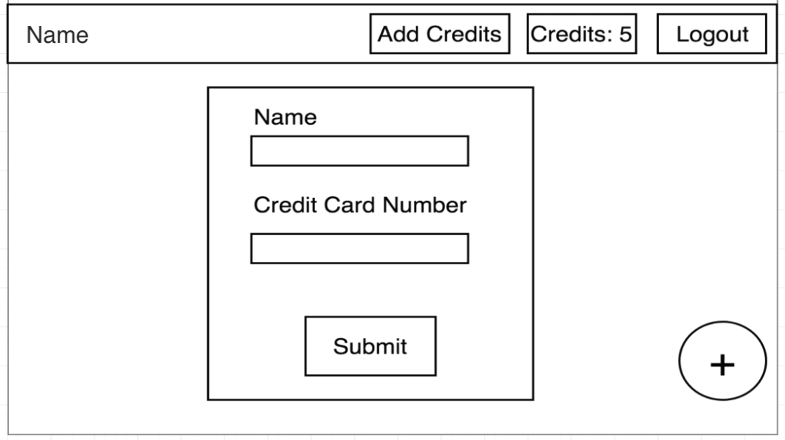
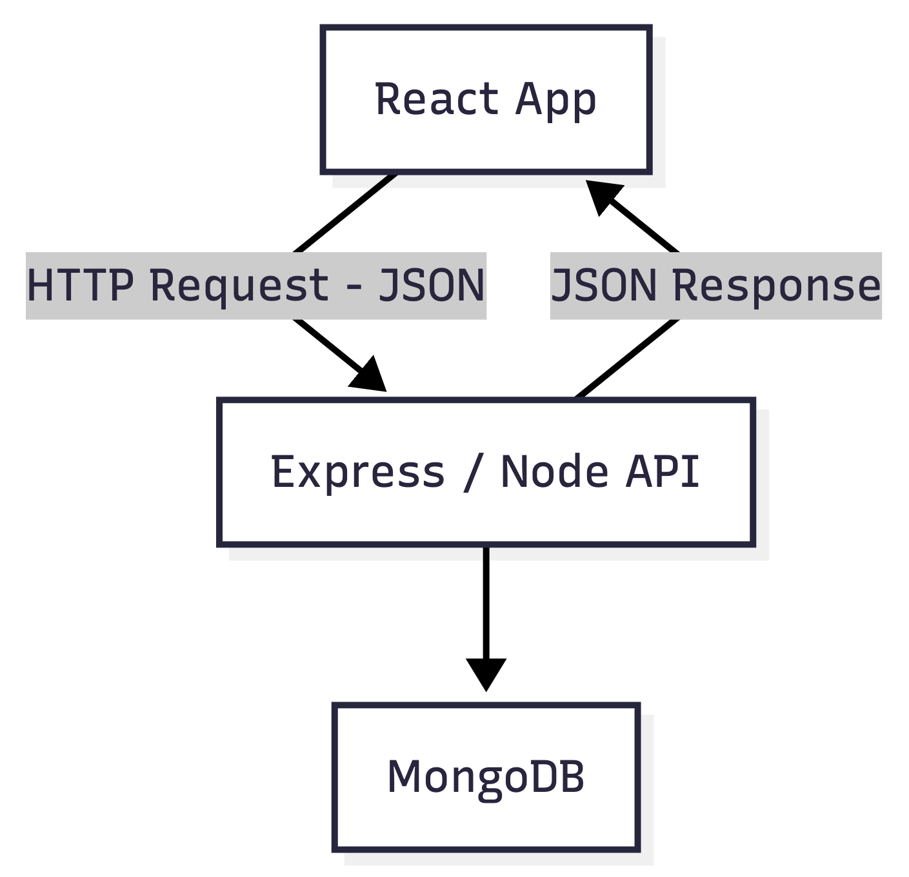
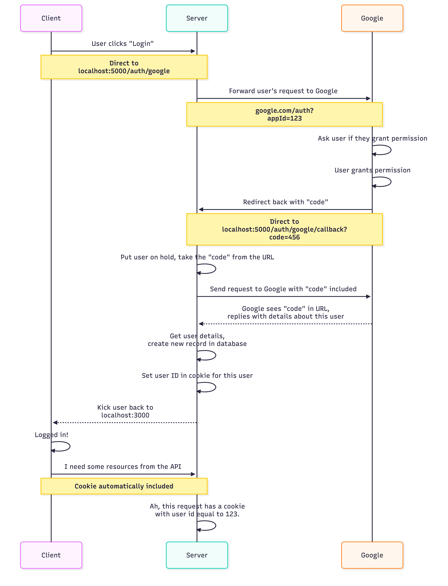

# node-with-react

## Description

A large feedback-collection web application that profiles the advanced features of React, Redux, Express, and Mongo.

## User Story

<b>AS A</b> startup owner of an app/service.  
<b>I WANT</b> feedback from users.  
<b>SO THAT</b> I can make app/service better.

| User Flow Walkthrough                                | Tech                                    |
| ---------------------------------------------------- | --------------------------------------- |
| User signs up via Google OAuth                       | Express Server PassportJS MongoDB |
| User pays for email credits via Stripe               | Stripe API MongoDB                   |
| User creates a new ‘campaign’                        | React Redux                          |
| User enters list of emails to send survey to         | React Redux Redux Form            |
| App sends email to list of surveyees                 | Email Provider                          |
| Surveyees click on link in email to provide feedback | Email Provider Express MongoDB    |
| App tabulates feedback                               | MongoDB                                 |
| User can see report of all survey responses          | React Redux MongoDB               |

## Wireframe

## Architecture

Application

## Authentication with Google OAuth

## MongoDB

## Dev vs. Prod Enviroments

## Client Side

## Handling Payments

## Routing

## Mongoose

## Webhooks
