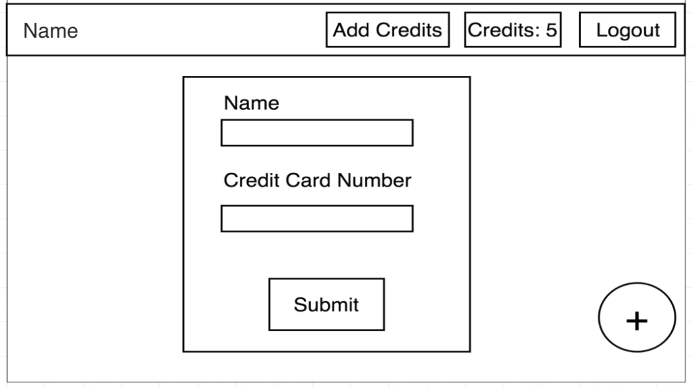

# node-with-react

## Description

A large feedback-collection web application that profiles the advanced features of React, Redux, Express, and Mongo.

This application demonstrates a complete full-stack architecture that integrates:

- Secure user authentication (Google OAuth)
- State management with Redux
- Payment processing (Stripe)
- Email delivery and tracking (SendGrid)
- Survey creation and response collection
- Webhook-driven event processing

It is designed to reflect real-world production patterns including separation of concerns, asynchronous workflows, and external service integration.

## Tech Stack

**Frontend**

- React
- Redux / Redux Thunk
- React Router
- Material UI

**Backend**

- Node.js
- Express
- MongoDB (Mongoose)

**External Services**

- Google OAuth (Passport.js)
- Stripe API
- SendGrid API + Webhooks

**Deployment**

- Heroku

## User Story

<b>AS A</b> startup owner of an app/service.  
<b>I WANT</b> feedback from users.  
<b>SO THAT</b> I can make app/service better.

</br>

| User Flow Walkthrough                                | Tech                                    |
| ---------------------------------------------------- | --------------------------------------- |
| User signs up via Google OAuth                       | Express Server<br>PassportJS<br>MongoDB |
| User pays for email credits via Stripe               | Stripe API<br>MongoDB                   |
| User creates a new ‘campaign’                        | React<br>Redux                          |
| User enters list of emails to send survey to         | React<br>Redux<br>Redux Form            |
| App sends email to list of surveyees                 | Email Provider                          |
| Surveyees click on link in email to provide feedback | Email Provider<br>Express<br>MongoDB    |
| App tabulates feedback                               | MongoDB                                 |
| User can see report of all survey responses          | React<br>Redux<br>MongoDB               |

**Wireframe**



## Architecture

### Data Model

User:

- `googleId`
- `credits`

Survey:

- `title`
- `subject`
- `body`
- `recipients[]`
- `yes`
- `no`
- `dateSent`
- `lastResponded`

### Routing

Client-Side:

- React Router
- Protected routes based on authentication state

Server-Side:

- RESTful API endpoints
- Production routing for React build

### API Endpoints

Auth:

- `GET /auth/google`
- `GET /auth/google/callback`
- `GET /api/current_user`
- `GET /api/logout`

Billing:

- `POST /api/stripe`

Surveys:

- `GET /api/surveys`
- `POST /api/surveys`
- `GET /api/surveys/:surveyId/:choice`

Webhooks:

- `POST /api/surveys/webhooks`

### Authentication

Authentication is handled using **Passport.js with Google OAuth**.

Flow:

1. User initiates login
2. Redirect to Google OAuth consent screen
3. Google returns user profile
4. User is stored in MongoDB
5. Session cookie is issued

Key Features:

- Persistent login via cookies
- Secure session handling
- User serialization/deserialization

### Form Handling

Forms are built using **Redux Form**.

Features:

- Dynamic form fields
- Reusable field components
- Custom validation logic
- Multi-step form flow

Validation:

- Email validation
- Required fields
- Error messaging UI

### Payments (Stripe)

Users purchase credits to send surveys.

Implementation:

- Stripe Checkout for client-side payment
- Token sent to backend
- Server creates charge via Stripe API
- User credits updated in database

Covered:

- Secure payment flow
- Token handling
- Server-side charge validation

### Email System (SendGrid)

Features:

- Send survey emails to multiple recipients
- Dynamic email templates
- Click tracking for responses

Implementation Details:

- Mailer class abstraction
- HTML email generation
- Personalized links per recipient

### Survey System

Capabilities:

- Create surveys with title, subject, and body
- Send surveys to multiple recipients
- Track responses (Yes / No)

### Webhook Processing

Handles asynchronous events from SendGrid when recipients interact with emails.

Pipeline:

1. Receive webhook events
2. Parse URL to extract survey ID and response
3. Remove invalid or duplicate events
4. Aggregate valid responses
5. Update MongoDB records

Techniques Used:

- Lodash chaining for data transformation
- Regex-based route parsing
- MongoDB atomic updates

### Environment Configuration

Required Variables:

```
GOOGLE_CLIENT_ID=
GOOGLE_CLIENT_SECRET=
MONGO_URI=
COOKIE_KEY=
STRIPE_SECRET_KEY=
STRIPE_PUBLISHABLE_KEY=
SENDGRID_API_KEY=
REDIRECT_DOMAIN=
```
